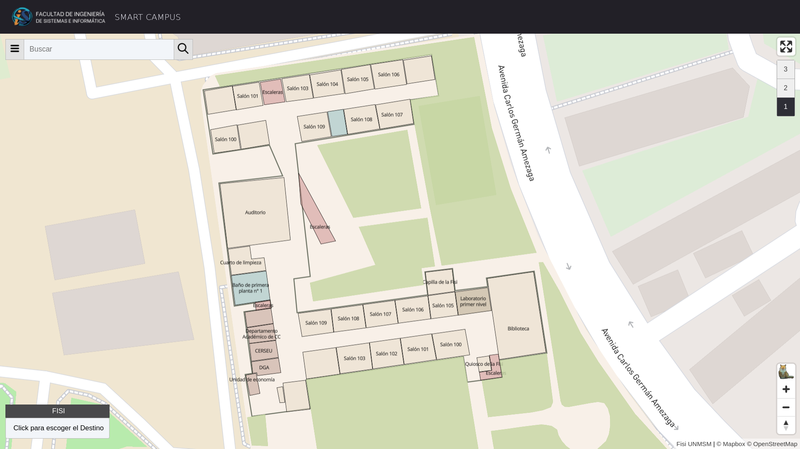
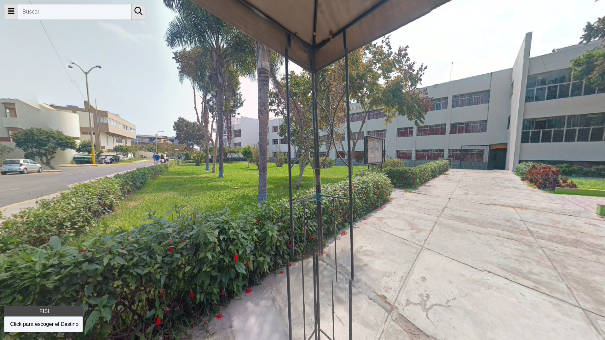

<p align="center">
    <h1 align="center">Smart Campus FISI</h1>
</p>

Developing

```bash
git clone https://github.com/typo-fisi/smart-campus-fisi
cd smart-campus-fisi
npm run dev
```

Building

```bash
npm run build
```

## Showcase

The application is deployed at <https://smart-campus-fisi.vercel.app/>.





## Thanks to

The team

- Gerardo Rivera [@DangoMelon](https://github.com/DangoMelon)
- Paolo Flores [@paoloose](https://github.com/paoloose)
- Rodrigo Alva [@pandadiestro](https://github.com/pandadiestro)

La Facultad de Ingeniería de Sistemas e Informática

- A la organización por la increíble oportunidad
